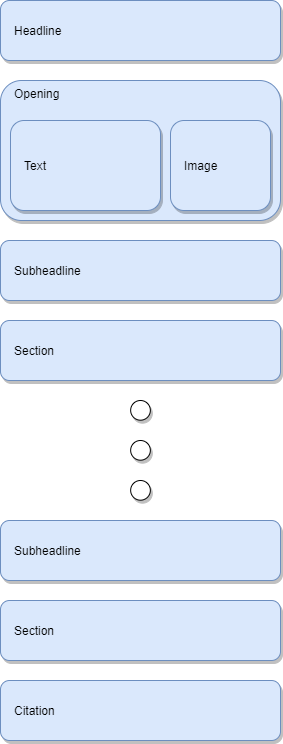

# LeoML (version 1.0.0)

LeoML is a machine-readable markup language for outlining and formatting text and other data, which is
using the JSON format for structuring the content. LeoML is using templates in order to structure 
the text.

Version 1.0.0 of LeoML knows two types of templates:

1. Blog
2. Article

## Table of contents
1. [General](#general)
2. [Objects](#objects)
3. [Blog template](#blog-template)
4. [Article template](#article-template)

## General

1. A LeoML document is always an array of objects.
2. The first object of an LeoML document is the type object, which defines the template.
3. Only one level of nested objects is possible.
4. In general, objects are flexible usable within a template, except the template defines restrictions. E. g.: The first object must be always a 'headline' object.

## Objects

An object can have following attributes:

| Attribute             | Explanation                                                                                                             |
|-----------------------|-------------------------------------------------------------------------------------------------------------------------|
| Tag name              | Name of the corresponding attribute.                                                                                    | 
| Condition             | Indicates, if a tag is mandatory or optional.                                                                           |
| Cardinality           | Indicates, how many elements of the object the LeoML document must contain.                                             | 
| value                 | Predefined value for a specific attribute. Just required for the object "type".                                         |
| Data type             | Data type of the object. Atomic objects can be only from data type "String". Nested data types are from type "complex". |
| Sub tags              | Name of the attributes of the nested object.                                                                            |
| Condition of sub tags | Indicates, if a sub tag is mandatory or optional.                                                                       |
| Sub tag data type     | Data type of the nested object. Attributes of a nested object are always atomic. Therefore, its data type is "String".  |

## Blog template

### Recommended blog layout

We recommend following layout for your blog post:



A citation can be added after each section or at the end of the text. A section can be also followed
by another section, but we advice to keep your sections to a minimum.

### Blog objects

#### type

Defines that the current LeoML document is a blog post.

| Tag name | Condition | Cardinality | value | Data type | Sub tags | Condition of sub tags | Sub tag data type |
|----------|-----------|-------------|-------|-----------|----------|-----------------------|-------------------|
| type     | mandatory | 1           | blog  | String    | none     | none                  | none              |

Attention:

1. The "type" tag must be the first tag within a LeoML document.
2. The value must be "blog".

Example

```JSON
[
  {
    "type": "blog"
  }
]
```

#### headline

Main headline of the blog post.

| Tag name | Condition | Cardinality | Data type | Sub tags | Condition of sub tags | Sub tag data type |
|----------|-----------|-------------|-----------|----------|-----------------------|-------------------|
| headline | mandatory | 1           | String    | none     | none                  | none              |

Attention:

The headline always follows the type object.

Example

```JSON
[
  {
    "headline": "<your headline>"
  }
]
```

#### opening

Short abstract of your article, which does not contains more than 3 or 4 sentences.

| Tag name | Condition | Cardinality | Data type | Sub tags   | Condition of sub tags | Sub tag data type |
|----------|-----------|-------------|-----------|------------|-----------------------|-------------------|
| opening  | mandatory | 1           | complex   | text       | mandatory             | String            |
|          |           |             |           | imageURL   | optional              | String            |

It is recommended to use an image for the opening, but there may not always be a need for it.
Therefore this attribute is optional.

Attention:

The opening object always follows the headline object.

Example

```JSON
[
  {
    "opening": {
      "text": "<your text>",
      "imageURL": "<your image url>"
    }
  }
]
```

#### subHeadline

Headline of a section.

| Tag name    | Condition | Cardinality | Data type | Sub tags | Condition of sub tags | Sub tag data type |
|-------------|-----------|-------------|-----------|----------|-----------------------|-------------------|
| subHeadline | mandatory | 1-n         | String    | none     | none                  | none              |

Example

```JSON
[
  {
    "subHeadline": "<your sub headline>"
  }
]
```

#### section

Contains the text for a section.

| Tag name | Condition | Cardinality | Data type | Sub tags | Condition of sub tags | Sub tag data type |
|----------|-----------|-------------|-----------|----------|-----------------------|-------------------|
| section  | mandatory | 1-n         | String    | none     | none                  | none              |

Example

```JSON
[
  {
    "section": "<your section content>"
  }
]
```

#### list

Contains a list of at least two elements.

| Tag name | Condition | Cardinality | Data type | Condition of list elements | Cardinality of list elements | List element data type |
|----------|-----------|-------------|-----------|----------------------------|------------------------------|------------------------|
| list     | optional  | 0-n         | list      | mandatory                  | 2-n                          | String                 |

Example

```JSON
[
  {
    "list": [
      "<element 1>",
      "<element 2>",
      "...",
      "<element n>"
    ]
  }
]
```

#### citation

Contains a single citation.

| Tag name | Condition | Cardinality | Data type | Sub tags | Condition of sub tags | Sub tag data type |
|----------|-----------|-------------|-----------|----------|-----------------------|-------------------|
| citation | optional  | 0-n         | String    | none     | none                  | none              |

Example

```JSON
[
  {
    "citation": "<citation>"
  }
]
```

#### image

| Tag name | Condition   | Cardinality | Data type | Sub tags           | Condition of sub tags | Sub tag data type  |
|----------|-------------|-------------|-----------|--------------------|-----------------------|--------------------|
| image    | optionality | 0-n         | complex   | imageURL           | mandatory             | String             |
|          |             |             |           | imageDescription   | optional              | String             |

Example

```JSON
[
  {
    "image": {
      "imageURL": "<your image url>",
      "imageDescription": "<your image description>"
    }
  }
]
```

### Example of LeoML blog document

```JSON
[
  {
    "type": "blog"
  },
  {
    "headline": "Why are plants good for home?"
  },
  {
    "opening": {
      "text": "We have known for a long time that plants are good for our well-being, but what exactly do they do? We have listed 10 reasons why you should have plants at home.",
      "imageURL": "<image-url>"
    }
  },
  {
    "subHeadline": "Plants reduce stress"
  },
  {
    "section": "Research has shown that plants in the home help reduce stress. The sight of the color green has a calming effect, so people who are in a green room have lower blood pressure and feel more relaxed and happy."
  },
  {
    "subHeadline": "Plants clear stuffy noses"
  },
  {
    "section": "Plants in the home reduce the risk of colds and nasal congestion by 30%. This is because plants increase humidity and absorb dust particles from the air."
  },
  {
    "subHeadline": "Plants provide clean air in the house"
  },
  {
    "section": "Plants not only bind dust, they also filter pollutants from indoor air. Among other things, they absorb carbon dioxide and convert it into oxygen. The higher humidity also improves the indoor climate in the house. A NASA study shows that plant species such as Epipremnum and Spathiphyllum can purify indoor air."
  },
  {
    "subHeadline": "Plants prevent allergies"
  },
  {
    "section": "Do you have small children? Then you should definitely have plants in the house. Children who grow up in a green environment with lots of plants at a young age have a lower risk of allergies."
  },
  {
    "subHeadline": "Plants against cigarette smoke"
  },
  {
    "section": "Plants filter the toxins contained in cigarette smoke. Is there smoking in your home? Then the spathiphyllum is a good choice."
  },
  {
    "subHeadline": "Plants improve the acoustics in the house"
  },
  {
    "section": "The leaves of plants can absorb background noise, improving indoor acoustics. Are you moving into a new house or have your workplace at home? Then put some plants in your living and working spaces as soundproofing."
  },
  {
    "subHeadline": "Plants provide a restful sleep"
  },
  {
    "section": "Do you have trouble falling asleep or wake up often at night? Air-purifying houseplants create a better indoor climate in your bedroom and generate oxygen. So, in addition to their calming and relaxing properties, plants help you sleep better at night. Choose a location near your bed or hang a LivePicture GO over your bed, for example."
  },
  {
    "subHeadline": "Plants lift the mood"
  },
  {
    "section": "Research shows that plants help fight depression. Plants improve the state of mind, provide positive energy, and make you feel happier."
  },
  {
    "subHeadline": "Plants reduce the risk of headaches"
  },
  {
    "section": "The air-purifying property of plants can counteract headaches. Researchers discovered that plants can filter a number of indoor chemicals such as benzene, trichloroethylene and formaldehyde from indoor air. Formaldehyde, a common cause of headaches, is a gas used in the manufacture of leather or carpet and is found in almost every indoor environment."
  },
  {
    "subHeadline": "Plants increase the ability to concentrate"
  },
  {
    "section": "Clean air, better mood, healthier living environment - to the positive effects of plants is added another, which is especially important if you study or work from home: Plants promote concentration. Research has shown that a natural, green environment helps you refocus after a brief distraction, stay more alert and counteract emerging fatigue. Boost your productivity by placing plants on, behind or above your desk."
  },
  {
    "citation": "https://mobilane.com/de/nachrichten/10-vorteile-von-zimmerpflanzen/#:~:text=Pflanzen%20sorgen%20für%20saubere%20Luft,verbessert%20das%20Raumklima%20im%20Haus. - opened on 07-02-2023 at 20:19 CET"
  }
]
```

## Article template

### Recommended article layout

We recommend following layout for your article:


### Article objects

#### type

Defines that the current LeoML document is an article.

| Tag name | Condition | Cardinality | value   | Data type | Sub tags | Condition of sub tags | Sub tag data type |
|----------|-----------|-------------|---------|-----------|----------|-----------------------|-------------------|
| type     | mandatory | 1           | article | String    | none     | none                  | none              |

Attention:

1. The "type" tag must be the first tag within a LeoML document.
2. The value must be "article".

Example

```JSON
[
  {
    "type": "article"
  }
]
```

#### headline

Main headline of the article.

| Tag name | Condition | Cardinality | Data type | Sub tags | Condition of sub tags | Sub tag data type |
|----------|-----------|-------------|-----------|----------|-----------------------|-------------------|
| headline | mandatory | 1           | String    | none     | none                  | none              |

Attention:

The headline always follows the type object.

Example

```JSON
[
  {
    "headline": "<your headline>"
  }
]
```

#### subHeadline

Gives additional content to the headline.

| Tag name    | Condition | Cardinality | Data type | Sub tags | Condition of sub tags | Sub tag data type |
|-------------|-----------|-------------|-----------|----------|-----------------------|-------------------|
| subHeadline | optional  | 0-1         | String    | none     | none                  | none              |

Attention:

The subHeadline must follow the headline.

Example

```JSON
[
  {
    "subHeadline": "<your sub headline>"
  }
]
```

#### sectionHeadline

Headline of a section.

| Tag name    | Condition | Cardinality | Data type | Sub tags | Condition of sub tags | Sub tag data type |
|-------------|-----------|-------------|-----------|----------|-----------------------|-------------------|
| subHeadline | optional  | 0-n         | String    | none     | none                  | none              |

Example

```JSON
[
  {
    "sectionHeadline": "<your sub headline>"
  }
]
```

#### section

Contains the text for a section.

| Tag name | Condition | Cardinality | Data type | Sub tags | Condition of sub tags | Sub tag data type |
|----------|-----------|-------------|-----------|----------|-----------------------|-------------------|
| section  | mandatory | 1-n         | String    | none     | none                  | none              |

Example

```JSON
[
  {
    "section": "<your section content>"
  }
]
```

#### catchLine

Is a very eye-catching excerpt from the actual text.

Example for a catch line: "Veni, vidi, vici" - "I came, I saw, I conquered." wrote Julius Caeser to
the Roman Senate in 47 BC after the battle of Zela was won.

| Tag name  | Condition | Cardinality | Data type | Sub tags | Condition of sub tags | Sub tag data type |
|-----------|-----------|-------------|-----------|----------|-----------------------|-------------------|
| catchLine | optional  | 0-n         | String    | none     | none                  | none              |

Example

```JSON
[
  {
    "catchLine": "<your catch line>"
  }
]
```

#### list

Contains a list of at least two elements.

| Tag name | Condition | Cardinality | Data type | Condition of list elements | Cardinality of list elements | List element data type |
|----------|-----------|-------------|-----------|----------------------------|------------------------------|------------------------|
| list     | optional  | 0-n         | list      | mandatory                  | 2-n                          | String                 |

Example

```JSON
[
  {
    "list": [
      "<element 1>",
      "<element 2>",
      "...",
      "<element n>"
    ]
  }
]
```

#### citation

Contains a single citation.

| Tag name | Condition | Cardinality | Data type | Sub tags | Condition of sub tags | Sub tag data type |
|----------|-----------|-------------|-----------|----------|-----------------------|-------------------|
| citation | optional  | 0-n         | String    | none     | none                  | none              |

Example

```JSON
[
  {
    "citation": "<citation>"
  }
]
```

#### image

| Tag name | Condition   | Cardinality | Data type | Sub tags           | Condition of sub tags | Sub tag data type |
|----------|-------------|-------------|-----------|--------------------|-----------------------|-------------------|
| image    | optionality | 0-n         | complex   | imageURL           | mandatory             | String            |
|          |             |             |           | imageDescription   | optional              | String            |

Example

```JSON
[
  {
    "image": {
      "imageURL": "<your image url>",
      "imageDescription": "<your image description>"
    }
  }
]
```

### Example of LeoML article document

```JSON
[
  {
    "type": "article"
  },
  {
    "headline": "The Rise of Artificial Intelligence"
  },
  {
    "subHeadline": "Pioneering the Future of Technology"
  },
  {
    "section": "Artificial Intelligence (AI) has been a buzzword for several decades, and its applications have seen remarkable progress over the years. From self-driving cars to virtual personal assistants, AI is transforming the way we live and work. In this article, we will explore the fascinating world of artificial intelligence, its history, current advancements, ethical implications, and the potential it holds for the future."
  },
  {
    "sectionHeadline": "The Evolution of Artificial Intelligence"
  },
  {
    "section": "The concept of artificial intelligence dates back to ancient mythology and science fiction tales, where machines or human-like beings possessed intelligence and consciousness. However, it wasn't until the 20th century that the term \"artificial intelligence\" was coined. Early AI research focused on symbolic AI and rule-based systems, but progress was slow due to limitations in computing power."
  },
  {
    "sectionHeadline": "Machine Learning and Neural Networks"
  },
  {
    "section": "A significant breakthrough came with the advent of machine learning and neural networks. Machine learning algorithms enable computers to learn from data and improve their performance over time without explicit programming. Neural networks, inspired by the human brain's structure, revolutionized AI by enabling deep learning, a subfield of machine learning capable of processing vast amounts of complex data."
  },
  {
    "sectionHeadline": "Real-World Applications"
  },
  {
    "section": "AI has already permeated various industries, driving innovations and efficiency. In healthcare, AI is being used for medical image analysis, disease diagnosis, and drug discovery. In finance, AI algorithms optimize trading strategies and risk management. AI-powered chatbots enhance customer support in e-commerce and other sectors. Additionally, AI plays a crucial role in autonomous vehicles, natural language processing, and personalized marketing."
  },
  {
    "sectionHeadline": "Ethical Considerations"
  },
  {
    "section": "As AI becomes more integrated into our lives, ethical concerns have emerged. Issues related to privacy, data security, and bias in AI algorithms have sparked debates about responsible AI development. Ensuring that AI systems are fair, transparent, and accountable is vital to prevent unintended consequences and potential harm."
  },
  {
    "sectionHeadline": "Challenges and Limitations"
  },
  {
    "section": "Despite the rapid progress, AI faces several challenges. One key limitation is \"narrow AI,\" where systems excel at specific tasks but lack general intelligence. Achieving artificial general intelligence (AGI) that mimics human-like intelligence remains an ambitious goal, and researchers must overcome several technical hurdles. Additionally, the rapid growth of AI raises questions about its impact on the job market and the need for reskilling the workforce."
  },
  {
    "sectionHeadline": "The Future of AI"
  },
  {
    "section": "The future of AI holds immense potential. Advancements in quantum computing, robotics, and natural language processing will pave the way for more sophisticated AI applications. As AI becomes an integral part of society, policymakers, researchers, and stakeholders must work together to create robust regulations and frameworks that harness AI's benefits while mitigating risks."
  },
  {
    "sectionHeadline": "Conclusion"
  },
  {
    "section": "Artificial intelligence is an ever-evolving field that continues to shape our world. From streamlining business processes to revolutionizing healthcare and transportation, AI's impact is profound and far-reaching. As we embrace this technology, it is essential to prioritize ethical considerations and ensure that AI aligns with human values. By leveraging the power of AI responsibly, we can navigate the challenges and unlock its full potential for a brighter and more innovative future."
  },
  {
    "sectionHeadline": "Sources"
  },
  {
    "citation": "This text was created automatically by ChatGPT."
  }
]
```
